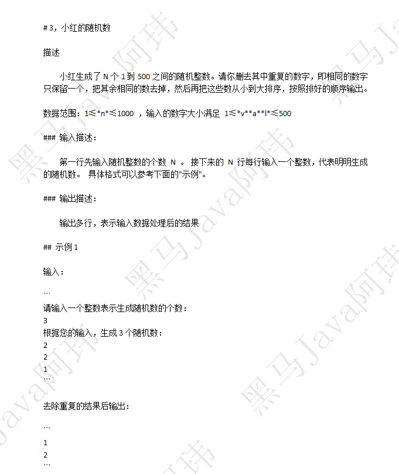
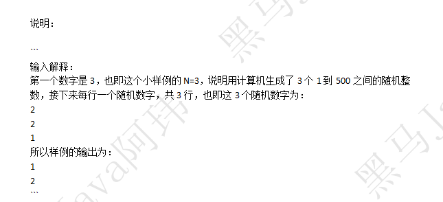
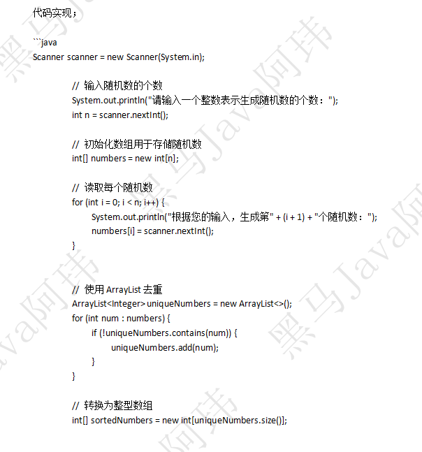
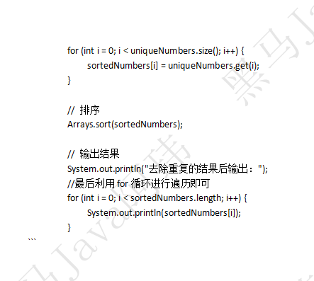

## 题目描述






## 代码实现

### 方式一

```java
import java.util.HashSet;
import java.util.Scanner;
import java.util.Set;
import java.util.TreeSet;

public class Main {

    public static void main(String[] args) {
        Scanner sc = new Scanner(System.in);
        long num = sc.nextLong();

        HashSet<Long> set = new HashSet<>();

        while ( num != 0 ){
            set.add(sc.nextLong());
            num--;
        }

        Set<Long> sortSet = new TreeSet<>();

        sortSet.addAll(set);

        System.out.println(sortSet);

        sc.close();

   }

}

```


### 方式二：








