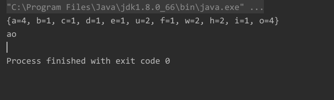

远清的面试题：


题目描述：

1个字符串中可能包含a-z中的多个字符，字符也可能重复，例如 `charal]=“dfafdafdafdafadfdafjkadfdafdafofidafefadfa”`写一个程序，对于给定一个这样的字符求出字符串出现次数最多的那个字母以及出现的次数（若次数最多的字母有多个，则全部求出）


代码实现：

```java
import java.util.HashMap;
import java.util.Map;

public class Main {
    public static void main(String[] args) {

        String s = "oeiawfhobcdoauaoauwh";
        System.out.println(replace(s));
 
    } 
    public static String replace(String s) {


        Map<Character,Integer> hm = new HashMap();

        for (int i = 0; i < s.length(); i++) {
            char c = s.charAt(i);
            if (!hm.containsKey(c)){
                //不存在
                hm.put(c, 1);

            }else {
                //存在
                hm.put(c, hm.get(c)+1);
            }

        }

        System.out.println(hm);

        int temp = 0;
        String s1 = "";
        for (Map.Entry<Character, Integer> entry : hm.entrySet()) {
            Integer value = entry.getValue();

            if (temp < value){
                s1 = entry.getKey() + "";
                temp = value;
                continue;
            }

            if (temp == entry.getValue()){
                s1+=(entry.getKey() + "");
            }

        }

        System.out.println(s1);

        return s1;
    }

}

```





